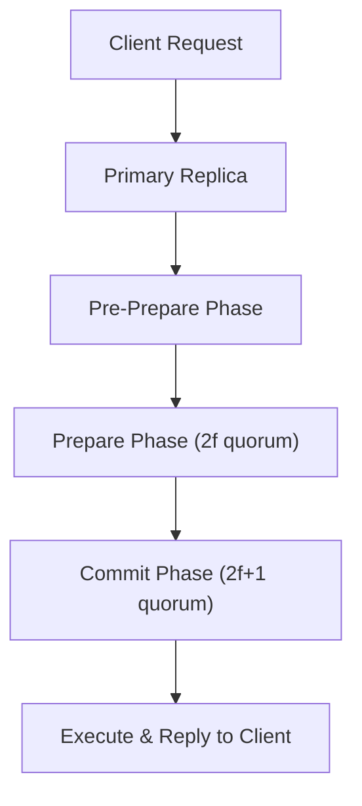

# Practical Byzantine Fault Tolerance (PBFT) Skill

High-efficiency, zero-dependency Python implementation of **Practical Byzantine Fault Tolerance (PBFT)** state machine replication.

## Features
- **3-Phase Consensus Protocol**: Pre-Prepare, Prepare (\(\ge 2f\)), and Commit (\(\ge 2f + 1\)).
- **Byzantine Resilience**: Tolerates up to \(f = \lfloor(N - 1)/3
floor\) malicious, compromised, or arbitrarily behaving replicas.
- **Zero External Dependencies**: Pure Python standard library.
- **Native MCP Protocol**: JSON-RPC 2.0 stdio server compatible with Claude Desktop, Cursor, and Windsurf.

## Architecture

